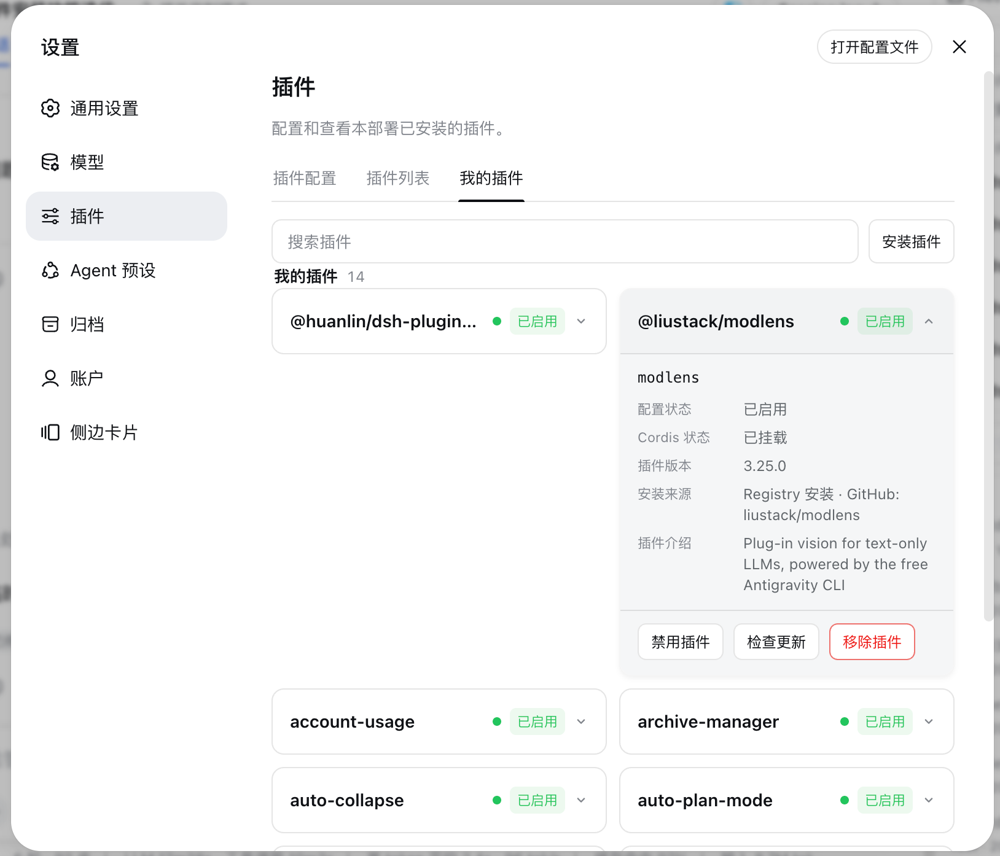
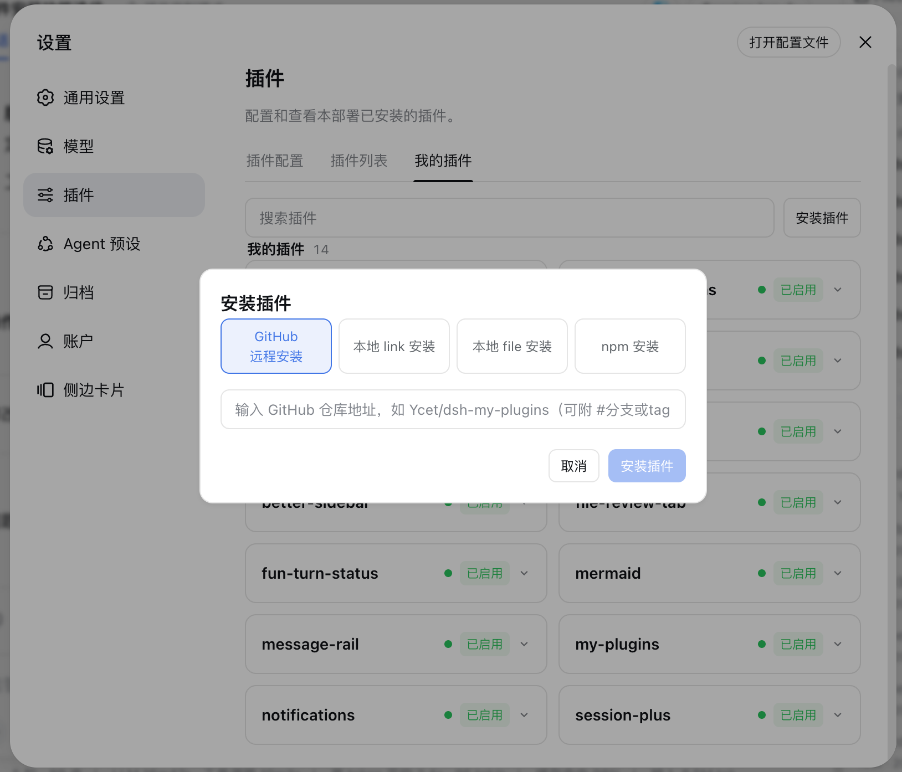

# dsh-my-plugins

[](README.md)
[](README_en.md)

<div align="center">

DeepSeek Harness（DSH）插件管理面板：在「设置 → 插件」页新增「我的插件」标签，一键安装（GitHub / Link / File / npm）、集中查看插件版本、启停、GitHub 更新检查与二次确认移除。

[](LICENSE)
[](package.json)
[](https://github.com/deepseek-ai/deepseek-harness)

</div>

---

## 📑 目录

- [📸 界面预览](#-界面预览)
- [✨ 功能特性](#-功能特性)
- [🚀 快速开始](#-快速开始)
- [📖 使用说明](#-使用说明)
- [🔧 工作原理](#-工作原理)
- [🧪 开发与测试](#-开发与测试)
- [⚠️ 已知限制](#️-已知限制)
- [🤝 贡献](#-贡献)
- [📄 许可证](#-许可证)

---

## 📸 界面预览

「设置 → 插件 → 我的插件」页（v1.4.0）：搜索框右侧新增「安装插件」按钮，弹窗支持 GitHub / link / file / npm 四种安装方式；插件卡片列表含版本、安装来源、配置与 Cordis 状态。





---

## ✨ 功能特性

| 功能 | 说明 |
|------|------|
| **「我的插件」标签页** | 在「设置 → 插件」页新增独立标签（`mine`），集中展示用户安装的插件 |
| **一键安装插件** | 搜索框右侧「安装插件」弹窗，支持 GitHub 远程安装、本地 link 安装、本地 file 安装与 npm 安装四种方式（v1.4.0 起）；已安装同名插件时二次确认后切换安装来源 |
| **批量检查更新** | 搜索框右侧「检查更新」按钮，一键检查全部已安装插件的可更新版本（排除本地安装与手工 patch 来源，v1.6.0 起）；有更新的插件状态标签显示为黄色「待更新」，点击卡片「立即更新」后清除 |
| **插件卡片** | 每个插件一张卡片：名称、版本、介绍、安装来源（GitHub / 本地 / Registry / 手工 patch）；GitHub 安装来源与 Registry 卡片的 GitHub 上游文字为可点击链接，点击在新标签页打开对应仓库（v1.5.0 起） |
| **状态展示** | 配置状态（已启用/已停用）与 Cordis 挂载阶段（未挂载 / 等待依赖 / 加载中 / 已挂载 / 挂载失败 / 卸载中） |
| **搜索** | 按插件名称或介绍实时过滤 |
| **启停管理** | 一键禁用 / 启用插件，状态写入 profile 托管的 patch 覆盖块，重启 `dsh web` 后完全生效 |
| **GitHub 更新检查** | 对 GitHub 来源插件检查上游 Release，判断是否可安全更新（版本对比 + Git commit 确认） |
| **立即更新** | 通过官方 `dsh plugin` CLI 更新 GitHub 来源插件；更新前校验 profile 内的本地依赖是否失效（v1.3.6 起），避免更新破坏安装 |
| **二次确认移除** | 移除插件前弹出确认弹窗；通过官方 `dsh plugin remove` 执行，同时清理本插件托管的禁用状态块，重启后完成卸载 |
| **双语言界面** | 中英文界面，跟随 DSH 活动语言 |

---

## 🚀 快速开始

### 前提条件

- 已安装 DSH CLI 与 pnpm（`dsh plugin` 内部转发到 pnpm）

### 安装

```sh
# 方式一：从 GitHub 安装
dsh plugin --profile web add github:Ycet/dsh-my-plugins

# 方式二：从本地源码安装（开发）
dsh plugin --profile web add dsh-my-plugins@file:<absolute-path-to-plugin>
```

包声明了 `dsh.bundle` 补丁层，`dsh plugin` 会自动把加载项合入 profile 的 bundle 层，无需手动编辑 `cordis.patch.yml`。

> [!NOTE]
> `file:` 安装是快照：更新源码后需重新执行安装命令，再重启 `dsh web` 生效（bundle 层变更不热加载）。

### 启动

1. 重启网页应用：`dsh web`
2. 打开 http://127.0.0.1:3080，进入「设置 → 插件」
3. 切换到「我的插件」标签查看全部用户安装的插件

---

## 📖 使用说明

1. 打开「设置 → 插件 → 我的插件」；
2. **安装**：点击搜索框右侧「安装插件」，在弹窗中选择安装方式并输入地址/路径/包名后点击「安装」；GitHub 输入 `owner/repo`（可附 `#分支或tag`），link / file 输入本地绝对路径（link 自动读取源码 `package.json` 的包名），npm 输入包名（可附 `@版本`）；同名插件已安装时会提示确认后切换来源。安装完成后重启 `dsh web` 生效；
3. **批量检查**：点击搜索框右侧「检查更新」可一次检查所有已安装插件；有更新的插件状态标签变为黄色「待更新」，展开卡片点击「立即更新」逐个升级；
4. **搜索**：在顶部输入框按名称或介绍过滤插件；
5. **启停**：点击卡片上的「禁用插件 / 启用插件」，按提示重启 `dsh web` 后生效；
6. **更新**（GitHub 来源）：点击「检查更新」查看上游是否有新版本；有更新时点击「立即更新」，完成后重启 `dsh web` 生效；
7. **移除**：点击「移除插件」，在二次确认弹窗中点击「确认移除」，重启 `dsh web` 后完成卸载。

> [!NOTE]
> 安装、更新与移除均通过官方 `dsh plugin` CLI 执行；操作完成提示出现在页面右下角 toast 中，之后需在终端重启 `dsh web` 使改动完全生效。

---

## 🔧 工作原理

双面插件（宿主 + 浏览器）。宿主在 `webServer` 注册 `/my-plugins/api` 前缀路由（仅接受同源信任请求的 `POST`，按路径段分发方法）：

| 方法 | 路径 | 用途 |
| --- | --- | --- |
| `POST` | `/my-plugins/api/list` | 返回全部插件卡片（版本、来源、配置状态、Cordis 挂载阶段、可执行操作） |
| `POST` | `/my-plugins/api/check-all` | 批量检查全部可自动更新插件的可更新版本（排除本地与手工 patch 来源，v1.6.0 起） |
| `POST` | `/my-plugins/api/install` | 安装插件（`kind` 为 github/link/file/npm，`input` 为地址/路径/包名；已安装同名包时先返回 `needConfirm`，确认后执行） |
| `POST` | `/my-plugins/api/toggle` | 禁用 / 启用插件（写入 profile `cordis.patch.yml` 的托管状态块） |
| `POST` | `/my-plugins/api/check-update` | 检查 GitHub 上游 Release 与版本对比 |
| `POST` | `/my-plugins/api/update` | 通过 `dsh plugin` 更新 GitHub 来源插件 |
| `POST` | `/my-plugins/api/remove` | 通过 `dsh plugin remove` 移除插件并清理托管状态 |

关键机制：

- **安装输入校验**：GitHub `owner/repo`（可附 `#ref`）、npm 包名 / 版本、本地绝对路径均在服务端严格校验后才拼装 `dsh plugin ... add <spec>` 参数（link 方式自动读取源码目录 `package.json` 的 `name` 拼成 `<name>@link:<路径>`）；
- **同名安装确认**：npm / link 方式可解析出包名，若 profile 中已安装同名插件，先返回确认提示，用户确认后才执行覆盖安装（支持切换安装来源，如 `file:` → `github:`）；

- **托管状态块**：启停覆盖写入 profile 的 `cordis.patch.yml`，用 `# >>> dsh-my-plugins managed states >>>` 标记边界，由宿主维护，避免与手工补丁混淆；
- **来源判定**：根据包元数据识别 GitHub（`git+https://github.com/…` 等）、本地（`file:` 路径）、Registry（npm 版本规格）与手工 patch 四种来源，并据此决定是否支持自动更新；GitHub 来源及 Registry 上游的 `owner/repo` 经客户端同规则校验后渲染为指向 `https://github.com/<owner>/<repo>` 的链接（新标签页打开），非法元数据回退纯文本（v1.5.0 起）；
- **更新安全性**：`check-update` 做版本语义比较并确认已安装 commit；`update` 前校验 profile 内被引用的本地安装包是否失效（v1.3.6 起），存在失效依赖时拒绝更新并提示先修复安装来源；
- **移除清理**：`remove` 成功后同步清理该插件入口对应的托管禁用状态，保持 profile 补丁文件整洁。

---

## 🧪 开发与测试

```bash
npm test   # node --test test/*.test.mjs
```

`test/metadata.test.mjs` 覆盖纯函数契约：包根解析（`packageRootOf`）、来源判定（`sourceOf`）、GitHub 元数据与版本比较（`githubRepoOf` / `compareVersions`）、patch 插入块扫描（`scanPatchInsertIds`）、托管状态读写（`readManagedStates` / `writeManagedStates`）、更新参数构造（`updateArgsFor`）与失效本地依赖检测（`missingLocalDependency`）；v1.4.0 起新增安装输入校验（`resolveInstallSpec` / `splitNpmInput`）、同名依赖检测（`existingDependency`）与 CLI 错误摘要（`summarizeCliError`）用例。

---

## ⚠️ 已知限制

- **自动更新仅限 GitHub 来源**：Registry、本地安装与手工 patch 来源不支持自动更新，卡片会显示对应原因（`upstreamAhead` 表示 GitHub 上游已有新 Release，但当前 npm 安装源尚未发布可安装更新）。
- **固定引用无法跟踪**：插件固定在 tag 或 commit 时无法检查分支更新；无法确认已安装 Git commit 时不会安全判断更新。
- **操作需重启生效**：安装、启停、更新与移除均在重启 `dsh web` 后完全生效（bundle 层不热加载）。
- **安装同名覆盖**：npm / link 安装解析到已安装的包名时需二次确认；github / file 方式无法预先得知包名，重复安装由 pnpm 直接处理。
- **移除即卸载**：移除操作从当前 profile 删除插件依赖，属于不可逆操作，请谨慎使用。

---

## 🤝 贡献

欢迎提交 Issue 与 Pull Request：发现问题请携带 DSH 版本、插件版本与复现步骤到 [Issues](https://github.com/Ycet/dsh-my-plugins/issues) 反馈；改进请按 Fork → 分支 → PR 流程提交，并在提交前运行 `npm test` 确保契约测试通过。

---

## 📄 许可证

本项目使用 [MIT](LICENSE) 许可证。
